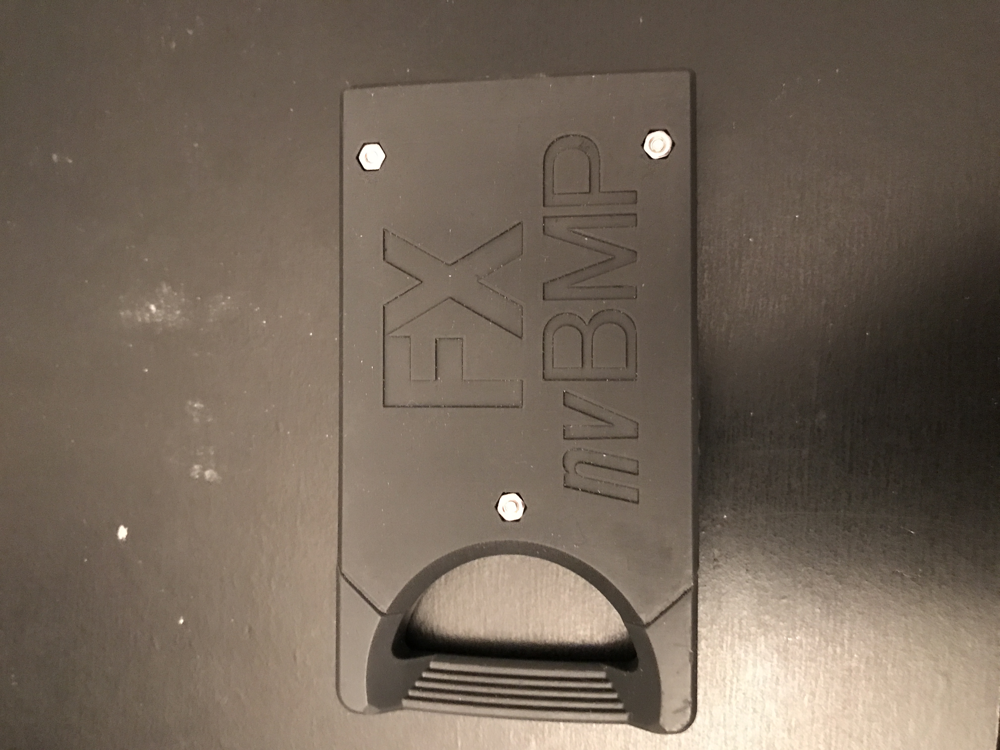
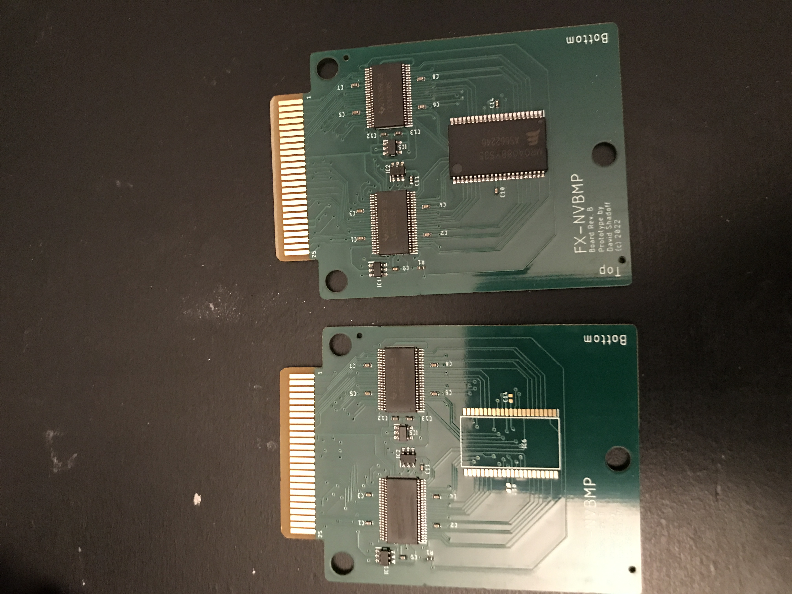

# PC-FX-NVBMP

This is a design of a non-volatile backup memory board for the PC-FX. It's based on the
FX-BMP, but doesn't need batteries, and allows for several different sizes.

## Design

I designed the board using the free version of EAGLE, which is limited to 2 layers and
100mm x 100mm board size.  I have included the project files as well as the gerber outputs.

The board design is "Rev_B", as there was a minor fault in the REV_A design.

## Assembly

I have included gerber files, as well as BOM.csv and assembly.csv files, for use with
JLCPCB's SMD assembly service, if you are interested in taking advantage of that.

The second time I tried to order, the MRAM chip was no longer available, and I have noticed
in the past that the empty area would be filled with solder paste and would not be smooth
upon delivery, making it more difficult to solder my own parts on... so I made a special
"empty_MRAM_variant" set of gerbers/BOM.csv/assembly.csv files. The way I used these was to
order boards for assembly (including the level shift, OR gates, voltage regulator, and all the
passive components except the capactiors next to the MRAM chip; I sheared the stencil slightly
above the MRAM chip, and used the stencil to apply solder paste for just the MRAM chip and
2 capacitors, using a hotplate to heat the boards after mounting the missing parts.

The MRAM part in use is MR0A08BCYS35 (TSOP2-44 package), but you could substitute any
other MR0A08... chip which uses the TSOP2-44 package (the 'Y' indicates this).
Additionally, MR2A08... (512KB) or MR4A08... (2MB) chips in the same line will also be
compatible as long as they also use the TSOP2-44 package.

## Case

You can also find the design for a case/enclosure, courtesy of Jeff Chen (Twitter: @jeffqchen).
This is suitable for any 3D printer; I particularly liked the resin prints I ordered online.
The case is designed to accept M2-12 socket-head screws and nuts.

## Circuit Design Concepts

I had originally considered using FRAM (Ferroelectric RAM) as the non-volatile memory type,
but when I went to search for parts, the 28V100 part was out of stock and had increased in
price significantly.  The next choice was MRAM (magnetoresistive RAM), which was available
(in very small quantities), slightly cheaper, and also had larger chips in the line which
shared the same footprint and pinout, so the board could be designed to accommodate the larger
chips without any changes (up to 2MB).

Also important, the pinout of the MRAM chip was very similar to the pinout of the FX-BMP
port, so a 2-layer board coul be made to accommodate it easier than FRAM.

As the PC-FX uses a 5V bus and these chips are based on 3V logic, level-shifters were required.

In order to drive the chip-select (low), a 3-input OR gate is used, requiring the following
lines to ALL be low in order to trigger the chip select:
 1. Cartridge select (keys in on range 0xE8000000 - 0xEFFFFFFF)
 2. A25 (narrows the range to 0xE8000000 - 0xEBFFFFFF)
 3. A24 (narrows the range to 0xE8000000 - 0xE9FFFFFF)

**NOTE:**\
The address lines are numbered according to the chip's address lines, which are not
necessarily the same as the CPU's address lines. The second byte on the memory chip is
actually memory address 0xE8000002, so the memory chip's A0 is effectively the CPU's A1).

